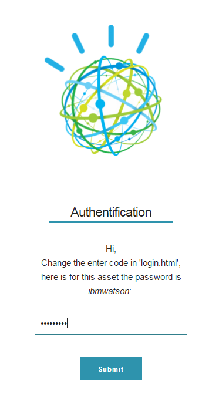
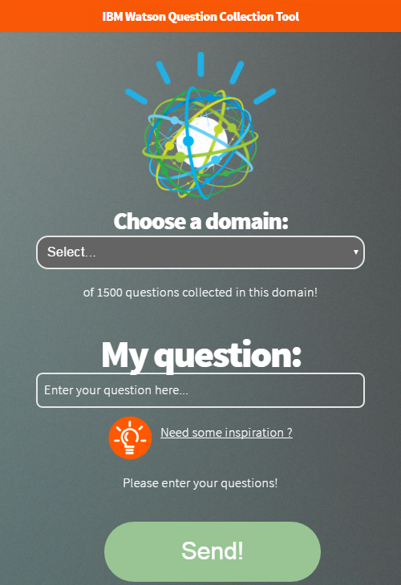
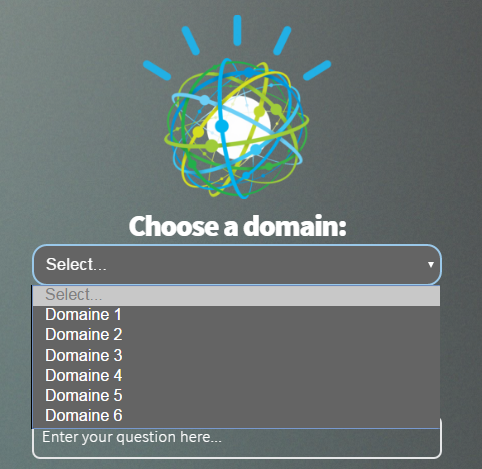

# IBM Watson Question Collection Tool (WATSON QCT)

This tool is used by GBS France and Watson France groupe to collect customer questions to creat intents and variations in Watson Conversation API. This tool is initially used by IBM Watson Lab Services to help collect questions for Watson Engagement Advisor (WEA).

The tool is developped on Node.js to provide a simple UI for users to enter questions which are stored in a database Cloudant. You can either run it in local or deploy it on IBM Bluemix.
- [Fonctionnalities](#Fonctionnalities)
- [Screenshots](#Screenshots)
- [Initial Setup](#initial-setup)
  - [Cloudant Setup](#cloudant-setup)
  - [Bluemix Setup](#bluemix-setup)
- [QCT Tool Access](#qit-tool-access)
- [Customizations](#customizations)


## Fonctionnalities:
- Collect questions and store them in a Cloudant database
- Add information about the questions such as (name, email, team, domain..)
- Visualise download questions.
- Show some scenarios to inspire users on the questions.

## Screenshots:

### Page login:


### First page, here you can add some information and the objectifs:


### Second page, here we ask  here you can add some information:


### Third page, choose a domain and post a question:



### Third page, you can also add some scenarios to help custumers to make a good question:
    


## Prerequisites

1. Create an IBM Cloudant account [https://cloudant.com](https://cloudant.com)
     - Cloudant will act as the database for the QCT tool
2. Create an IBM Bluemix account [https://console.ng.bluemix.net](https://console.ng.bluemix.net)
     - Bluemix is where the app will be hosted
3. Download QCT source code .zip archive
     - Save the source code to a local directory
4. Download Node.js


## Initial Setup

### Cloudant Setup

1. Login to Cloudant with the account that you created
2. Create a "configuration" DB in Cloudant
  - Go to the Databases tab
  - Click on "Add New Database"
  - Create a database called "configuration"
3. Create a "questions" DB in Cloudant
  - Go to the Databases tab
  - Click on "Add New Database"
  - Create a database called "questions"
4. Create an API Key for the "configuration" DB
  - Go to the Databases tab
  - Click on the "configuration" DB
  - Click on "Permissions"
  - Click on "Generate API key"
  - Record the Key and Password, they will not be displayed again
  - In the permissions table make sure the API key has "Reader" and "Writer" permissions
5. Create an API Key for the "questions" DB
  - Go to the Databases tab
  - Click on the "questions" DB
  - Click on "Permissions"
  - Click on "Generate API key"
  - Record the Key and Password, they will not be displayed again
  - In the permissions table make sure the API key has "Reader" and "Writer" permissions
6. Create a new document in the "configuration" DB document to represent the customer and copy the contents of "customer1.json"
  - Go to the Databases tab
  - Click on the "configuration" DB
  - Under the "All Documents" menu click the "+"
  - Select "New Doc" from the menu that is displayed
  - Replace the contents of the New Document with the sample "customer1.json"
  - The sample "customer1.json" can be found from the QIT source code in the directory <QIT>/lib/db/
  - Save the document
7. Update the customer doc in the "configuration" DB
  - Contiue modifying the new customer doc created in step #6
  - Update the "_id" and "name" fields to match the customer you're working with
  - Update the "questions_db" properties with the Cloudant account hostname and API key info created from step #5
  - Update the "users" property to specify the admin user accounts
  - Save the changes to the document
  - Click "Cancel" to exit the document edit view
8. Create database index for the "questions" DB
  - Go to the Databases tab
  - Click on the "questions" DB
  - Under the "All Design Docs" menu click the "+"
  - Select "New Doc" from the menu that is displayed
  - Replace the contents of the New Document with the sample code from "questions_index.json"
  - The sample "questions_index.json" can be found from the QIT source code in the directory <QIT>/lib/db/
  - Save the document
  

### Bluemix Setup

1. Login to Bluemix with the account that you created
2. Create a new app
  - Go to the "Dashboard" tab
  - Click on "Create App" under the "Cloudant Foundry Apps"
  - For the "What kind of app are you creating?" question choose "Web"
  - For the "How do you want to get started? question choose ".js SDK for Node.js" and click "Continue"
  - For the "What do you want to name your new app?" question enter a name and click "Finish"
  - You will be taken to a screen with the question "How do you want to start coding?"
  - In the background Bluemix will start the default app
3. Add GIT for your app
  - Click the "Overview" link from the left menu
  - Click "Add GIT" at the top right which will open a "Create GIT Repository" dialog
  - Check the option "Populate the repo with the starter app package" and click "Continue"
  - Click "Close" when after the repository is created
4. Setup the Environment Variables for the app
  - Click the "Environment Variables" from the left menu
  - Click on "User-Defined"
  - Click "Add" to create a new variable
  - Enter "CLOUDANT_R" for the name
  - Enter this connection string for the value {"cloudant":{"db":"configuration","username":"apikey","password":"password","host":"account.cloudant.com"}}
  - Replace the "username", "password" and "host" values with the api key and password along with your Cloudant account
  - Click "Add" again to create another new variable
  - Enter "CUSTOMER" for the name
  - Enter the customer ID that you specified in step #7 in the Cloudant Setup section
  - Click "Save" and the app will automatically be restarted
5. Import the QCT application source code to this app
  - Click the "Overview" link from the left menu
  - Click the "Edit Code" at the top right which will open a new browser tab to Bluemix DevOps Services
  - In the list of files for your app, delete the "index.html" under the "public" directory
  - Click back on the root directory for the app
  - Under the "File" menu select "Import > File or Zip Archive"
  - Choose the QIT source code .zip archive that you downloaded and click "OK" when prompted to unzip the archive
  - When the "Failed to transfer..." appears click "OK" to force the files to be overwritten
  - You should see the list of files updated with the contents of the QIT source code .zip archive
6. Sync the QCT source files with the master repository
  - Click the "GIT Repository" icon from the left menu
  - In the "Working Directory Changes" section click the "Select All" option to commit all the new files
  - In the "Enter the commit message" text area type in some comments like "Adding initial version of QIT tool"
  - Click "Commit" at the top right
  - In the "Active Branch" section click "Push" to deliver all the changes to the master repository
7. Build and Deploy the application
  - Click on the "Build and Deploy" at the top right
  - After the commit, Bluemix will automatically try to build and deploy all the new changes
  - You can follow the progress by viewing the two pipeline stages "Build Stage" and "Deploy Stage"
  - When the "Deploy Stage" shows "Deploy to dev succeeded" the app is available for access 


## Customizations
You can make serveral changes in the "configuration database" that you defined in Cloudant:

### Change the text shown:
Change it on the home page: `./views/home.hbs`. There are 3 sections in this application with ids: intro, one, two. You can change any texts/icons/images you want.

### Change the counter for domain.
Each time you change the domain we can see how many questions per domain were submitted. To change it: Go to `/views/home.hbs`. 
```sh
<p><span id="collected"></span> sur 1500 collectées dans ce domaine!</p>
...

...
var count = 0;
      var deferred = request(url, options);
      deferred.then(function(result) {
          result.questions.forEach(function(field) {

            questionsCollected += field.question;

            field.profile_fields.forEach(function(field1){
              //console.log(field1.value)
                if(field1.value.trim()==domaine.trim()){
                
                count++
                };
              })
          });
    document.getElementById("collected").innerHTML=count;
```
### Change the cookie expiration
Update the "cookie_expiration" property to the desired value, the time unit is in days
### Change the questions goal
Update the "questions_goal" property to the desired value, by defaut the value is 2000.
### Change the help text
Update the "help_text" property to the desired text, this will be display unter the question input text box.
### Change the profile fields
The interface can dynamically show profile fields for users to enter values for. These profile fields are controlled by the "profile_fields" property. The fields will be displayed under the "Your profile" section. Currently, we only support select drop-down list fields.
To do so: update the "profile_fields" contents where each section of the array is a separate field like the following:
```
    {
      "id": "domaine",
      "type": "select",
      "display": "domaine
      "values": [
        "domain 1",
        "domain 2",
        "domain 3",
      ]
    },
```
You can modify the "id" and "display" values to represent the type of profile value you want the users to enter
### Add a customer log on the Authentification page:
Change the login.html locats in `/public/login.html`, modify the img that you put in `/public/images`:
```html
  <div class="logo">
      
    </div>
```
### Change the scenario text:
Go to `.../views/home.hbs`, change the list scenario and put your scenarios separated by ",".

```html
/*Add scenarios*/
var scenario =[
"Scenario 1: Lorem ipsum dolor sit amet, consectetur",
"Scenario 2: Lorem ipsum dolor sit amet, consectetur",
"Scenario 3: Lorem ipsum dolor sit amet, consectetur",
"Scenario 4: Lorem ipsum dolor sit amet, consectetur",
"Scenario 5: Lorem ipsum dolor sit amet, consectetur",
"Scenario 6: Lorem ipsum dolor sit amet, consectetur",
"Scenario 7: Lorem ipsum dolor sit amet, consectetur",
"Scenario 8: Lorem ipsum dolor sit amet, consectetur",
"Scenario 9: Lorem ipsum dolor sit amet, consectetur"
];
```

